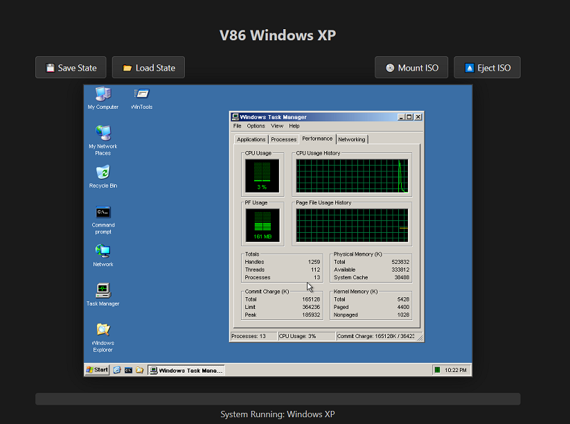
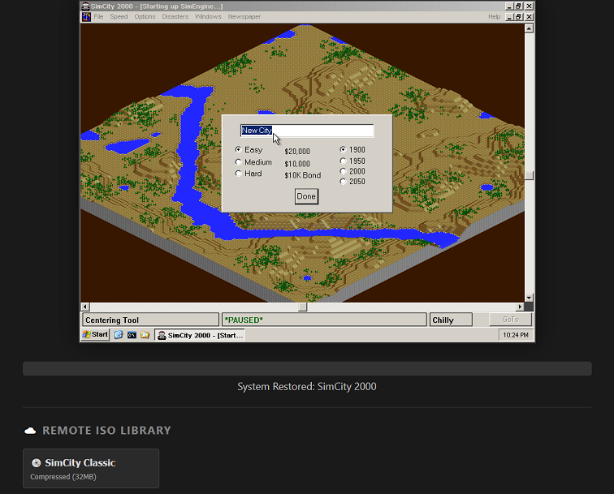
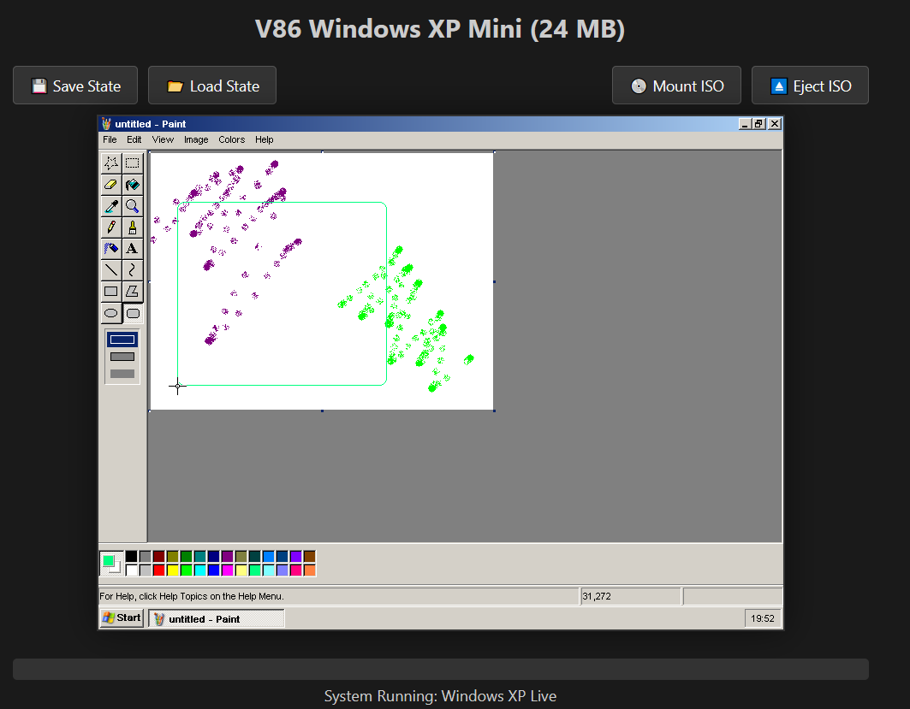

# Virtual Windows XP in the Browser

A fast, state-based Windows XP environment running entirely in the browser using a heavily modified **v86 / x86-box** emulator core.

This project focuses on **instant startup**, **snapshot-based restoration**, and **minimal file footprint**, avoiding traditional disk-image complexity.

<h2>Screenshots</h2>

<table>
  <tr>
    <td align="center">
       
      Windows XP Desktop SaveState 80 MB
    </td>
    <td align="center">
       
      SimCity 2000 SaveState 111 MB
    </td>
  </tr>
  
  <tr>
    <td align="center">
       
      Windows 7 SaveState 95 MB
    </td>
    <td align="center">
       
      Mini Windows Xp 24 MB Live ISO
    </td>
  </tr>
</table>

---

## ✨ Features

- **Custom user interface and seamless control frontend**
- **Customizable system configuration and runtime layout**
- **Pre-initialized operating system environments** for near-instant startup
- **State-based boot architecture** with snapshot save/load and restoration
- Optional **GZIP-compressed state files** for reduced storage and bandwidth
- Windows XP SaveState Only 80MB (27MB if using special Windows XP Mini Version) 
- **RAM-drive–based emulator restore state**
- No traditional hard-drive images
- No fragmented disk files or split `.bin` image sets
- Basic Experimental Windows 7 Support (Unstable with Loading And Unloading ISO Files)

---

## 📦 Media & State Handling

- Load and eject **user-provided ISO files**
- Load **web-server–hosted ISO files**
- Load saved emulator states **locally or from a web server directory**
- Optional `.gz` compression for:
  - Emulator state files
  - ISO files
- Automatic detection of compressed vs uncompressed assets

---

## 🌐 Deployment

- Fully **self-hosted**
- Requires only a **small set of files** on a standard web server
- Optimized for fast delivery and minimal configuration
- Modular and extendable UI
- Configurable UI button presets for:
  - Downloading remote ISO files
  - Automatically mounting them as emulated drives

---

## 🧠 Architecture Highlights

- Snapshot-first design (runtime state over disk images)
- RAM-native execution model
- Browser-based x86 emulation
- OS-agnostic control frontend
- Designed for experimentation, archival access, and educational use

---

## 👤 Project Attribution & Legal Notice

This web-based system is created and maintained by **Joel Lagace**.

It is built upon a **heavily modified and extended implementation** of the open-source  
**v86 / x86-box** emulator project, including a custom UI frontend, runtime layout, and state management system.

This project demonstrates browser-based x86 emulation and snapshot-based system restoration for **research, educational, archival, and experimental purposes**.

---

## 📜 Open Source Acknowledgements

This project incorporates and builds upon the following open-source software:

- **v86 / x86-box**  
  Repository: https://github.com/copy/v86  
  License: BSD-style open-source license

All original open-source licenses, notices, and attributions are preserved in accordance with their respective terms.

---

## ⚠️ Operating System Notice

Any operating systems shown or demonstrated using this emulator:

- Are **not distributed** as install media
- Are presented as **pre-configured runtime states** for demonstration purposes only

Users are responsible for ensuring they have the appropriate rights and licenses to use any operating system software within this environment.

---

## 🚫 No Affiliation

This project is an **independent, non-commercial technical demonstration** and is **not affiliated with, endorsed by, or sponsored by Microsoft** or any other operating system vendor.

## 🚀 Operating Instructions

### Requirements

- A **modern web server** (Apache, Nginx, IIS, etc.)
- Must be accessed via **http:// or https://**
- **`file://` access will NOT work**

> ⚠️ This project **must** be loaded from a web server.  
> Like all WASM-based applications, the emulator will **not initialize** if the page is opened directly from the filesystem (`file://`).

---

### Step 1 — Deploy to a Web Server

1. Copy the entire project directory to your web server.
2. Ensure it is accessible via an **HTTP or HTTPS URL**.
3. Navigate to the main **HTML UI loader file** that initializes the emulator.

This HTML file contains:
- All emulator parameters
- Snapshot configuration
- ISO mount definitions
- UI bindings

The code is **well indexed and commented** — modify as needed.

---

### Step 2 — Configure Snapshots & Systems

Inside the loader HTML file, you may:

- Point to different **saved snapshot (`.bin`) files**
- Add additional **remote ISO files**

When adding remote ISOs:
- Follow the same format as the provided example entries
- Be mindful of **CORS restrictions**:
  - If using **HTTP**, remote ISOs must be hosted on the **same web server**
  - If using **HTTPS**, cross-origin loading is allowed

---

### Step 3 — Optional Compression (Recommended)

To reduce:
- Download size
- Bandwidth usage
- Load times

You may optionally compress files using **GZIP** (e.g., with 7-Zip):

- Emulator snapshot files (`.bin.gz`)
- ISO files (`.iso.gz`)

Compression is **fully optional**.

The emulator automatically detects and loads:
- Raw `.bin` snapshots
- GZIP-compressed `.bin.gz` snapshots
- Raw `.iso` files
- GZIP-compressed `.iso.gz` files

---

### Step 4 — Installing Software Inside Windows XP

Once the Windows XP desktop is running:

1. Mount an ISO file
2. Install an application or game
3. Test that it runs correctly
4. Save the emulator state

You can then:
- Compress the resulting `.bin` snapshot
- Host it on your web server
- Reload it instantly later

---

### Step 5 — Organizing Multiple Systems (Important)

Best practice is to place **each saved system snapshot** in its **own directory**.

Example:

/free-solitaire/
├── index.html
├── emulator files
├── snapshot.bin.gz

Each system:
- Has its **own loader HTML**
- Points to its **own snapshot file**
- Can have its own RAM / video configuration

To create a new system:
1. Copy the base project folder
2. Replace the snapshot file
3. Update the loader HTML to point to the new snapshot

---

### ⚠️ Critical Snapshot Compatibility Rule

When restoring a snapshot, **all emulator settings must match exactly**.

This includes:
- RAM size (e.g. 512 MB)
- Video memory size (e.g. 32 MB)
- Disk States

If the loader HTML does **not** match the configuration used when the snapshot was saved:
- The emulator will **halt during restore**
- The snapshot **will not resume**

This is expected behavior for snapshot-based systems.

---

### Testing Without a Local Web Server

For testing and experimentation without local installation:

- Visit the **live demo hosted via archive.org**
- The demo provides:
  - Preconfigured systems
  - Example ISO mounts
  - Snapshot loading behavior

> Note: The local `iso/` directory in this repository may be empty.  
> Large ISO files are hosted separately on **archive.org** to keep the repository lightweight.

---

## 📝 Wishlist / To-Do

The following features are planned or under exploration for future versions of this project:

- **NE2000 Network Adapter Injection**
  - Enable live injection of an emulated NE2000 Ethernet device
  - Provide basic TCP/IP networking inside the running guest OS
  - Allow networking to be enabled or disabled per snapshot

- **Sound Blaster 16 Audio Support**
  - Inject Sound Blaster 16 (SB16) audio emulation into the live environment
  - Enable legacy audio support for early Windows 16bit applications
  - Provide simple UI toggles for sound enable/disable

- **Improved Snapshot Control**
  - Simplified save/load workflow
  - Clear snapshot metadata display (RAM size, video memory, OS type)
  - Snapshot compatibility validation before restore

- **Enhanced Frontend UX**
  - Unified system launcher page
  - One-click snapshot deployment
  - Cleaner UI for ISO management and system selection

These items are exploratory and will be implemented as emulator capabilities,
browser APIs, and stability allow.

This project is inspired by the **Archive.org Windows 3.1 live showcase**, expanded into a more modern, responsive system without:
- DOSBox limitations
- Long OS boot times
- Buggy legacy emulation paths

The goal is to provide a **modernized, snapshot-native browser desktop experience**.

